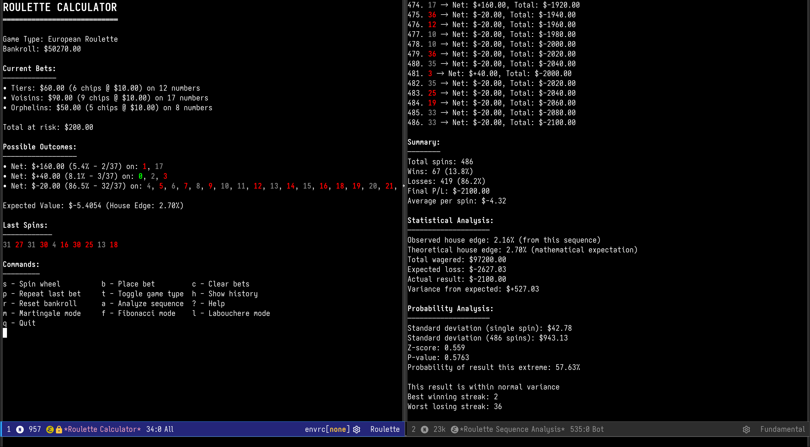

# Roulette Calculator

An elegant and comprehensive roulette betting calculator for Emacs, supporting both European and American roulette variants with advanced betting strategies and statistical analysis.



## Features

### Core Functionality
- **Dual Game Support**: Seamlessly switch between European (single zero) and American (double zero) roulette
- **Comprehensive Betting**: All standard bet types including straight, split, street, corner, line, dozen, column, and outside bets
- **Special Bets**: French betting patterns - Voisins du Zéro, Orphelins, and Tiers du Cylindre
- **Real-time Calculations**: Instant payout calculations and expected value analysis
- **Visual Feedback**: Color-coded number display (red/black/green) in the interface

### Advanced Features
- **Betting Strategies**: Built-in support for Martingale, Fibonacci, and Labouchere systems
- **Sequence Analysis**: Analyze historical sequences against your current betting pattern
- **Statistical Tracking**: Comprehensive statistics on spins, colors, and betting outcomes
- **Probability Analysis**: Real-time probability calculations and house edge display
- **Bankroll Management**: Track your balance with detailed win/loss history

## Installation

### Using straight.el
```elisp
(straight-use-package
 '(roulette-calculator :type git :host github :repo "LemonBreezes/roulette-calculator"))
```

### Using use-package
```elisp
(use-package roulette-calculator
  :commands (roulette-calculator)
  :bind ("C-c g r" . roulette-calculator))
```

### Manual Installation
1. Clone this repository or download `roulette-calculator.el`
2. Add to your load path:
```elisp
(add-to-list 'load-path "/path/to/roulette-calculator")
(require 'roulette-calculator)
```

## Usage

### Getting Started
Launch the calculator with `M-x roulette-calculator`. You'll be presented with an interactive interface showing:
- Current game type (European/American)
- Your bankroll
- Active bets
- Spin history
- Available commands

### Key Bindings
| Key | Command | Description |
|-----|---------|-------------|
| `s` | Spin wheel | Execute spin and calculate results |
| `b` | Place bet | Interactively place a new bet |
| `c` | Clear bets | Remove all current bets |
| `t` | Toggle game | Switch between European/American |
| `h` | History | View detailed betting history |
| `a` | Analyze | Analyze sequence against current bets |
| `r` | Reset bankroll | Set a new bankroll amount |
| `m` | Martingale | Enable Martingale strategy |
| `f` | Fibonacci | Enable Fibonacci strategy |
| `l` | Labouchere | Enable Labouchere strategy |
| `?` | Help | Show comprehensive help |
| `q` | Quit | Exit the calculator |

### Placing Bets

#### Standard Bets
- **Straight**: Single number (pays 35:1)
- **Split**: Two adjacent numbers (pays 17:1)
- **Street**: Three consecutive numbers (pays 11:1)
- **Corner**: Four numbers in a square (pays 8:1)
- **Line**: Six numbers in two rows (pays 5:1)
- **Dozen/Column**: 12 numbers (pays 2:1)
- **Outside bets**: Red/Black, Even/Odd, Low/High (pays 1:1)

#### Special Bets
- **Voisins du Zéro**: 17 numbers around zero (requires 9 chips)
- **Orphelins**: 8 orphan numbers (requires 5 chips)
- **Tiers du Cylindre**: 12 numbers opposite zero (requires 6 chips)

### Double Zero (00) Support
When playing American roulette:
- Enter "00" when prompted for straight bets
- The system correctly handles 00 as a green number
- All outside bets lose when 00 hits
- Sequence analysis accepts "00" in input strings

### Sequence Analysis
Analyze how your current betting pattern would perform against historical data:

1. Place your desired bets
2. Press `a` for analysis
3. Enter a sequence of numbers (e.g., "5,10,0,00,23,16")
4. View detailed results including:
   - Spin-by-spin outcomes
   - Win/loss statistics
   - Variance from expected value
   - Statistical significance testing

## Example Workflow

```
1. M-x roulette-calculator       ; Start the calculator
2. t                            ; Switch to American roulette
3. b                            ; Place bet
   > Straight                   ; Choose bet type
   > 00                        ; Bet on double zero
   > 10                        ; Bet $10
4. b                            ; Place another bet
   > Red                       ; Choose red
   > 20                        ; Bet $20
5. s                            ; Spin the wheel
6. h                            ; View history
7. a                            ; Analyze a sequence
   > 00,5,12,00,30,0          ; Enter historical data
```

## Statistical Features

The calculator provides comprehensive statistical analysis:
- **Expected Value**: Real-time EV calculation for your bet combination
- **House Edge**: Display of mathematical house advantage
- **Probability Distribution**: Shows all possible outcomes and their probabilities
- **Variance Analysis**: Statistical significance testing for sequence results
- **Z-score Calculation**: Determines if results are within normal variance

## Customization

### Variables
- `roulette-calculator-game-type`: Default game type ('european or 'american)
- `roulette-calculator-bankroll`: Starting bankroll amount
- `roulette-calculator-strategy-mode`: Active betting strategy

### Integration with Evil Mode
The package automatically sets up Evil keybindings when Evil mode is detected.

## Technical Details

### Internal Representation
- Numbers 0-36 are represented as-is
- Double zero (00) is internally represented as 37
- Colors and properties are calculated dynamically
- All calculations use exact arithmetic for accuracy

## Contributing

Contributions are welcome! Please feel free to submit issues, feature requests, or pull requests on the [GitHub repository](https://github.com/LemonBreezes/roulette-calculator).

## License

This package is distributed under the GNU General Public License v3.0. See the LICENSE file for details.

## Author

Created by StrawberryTea (<look@strawberrytea.xyz>)

---

*Remember: This calculator is for educational and entertainment purposes. Always gamble responsibly.*
